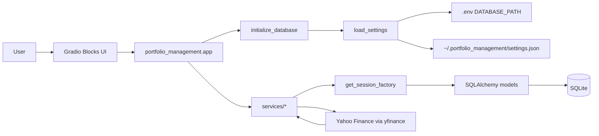
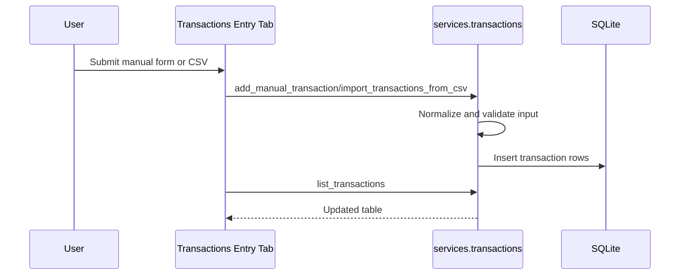
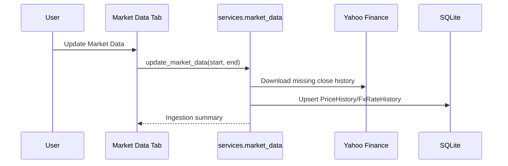
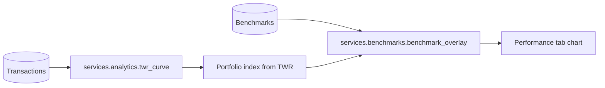

# Solution Architecture

Portfolio Tracker is a local-first portfolio management application built for a single user. It runs as a Gradio desktop-style web app backed by SQLite and SQLAlchemy.

The current implementation includes:

- Master data management (brokers, accounts, portfolios, securities)
- Manual and CSV transaction ingestion
- Cash transfer between accounts
- Market data ingestion (security prices and FX)
- Analytics (positions, allocation, summary, TWR)
- Rebalancing suggestions using target allocations
- Tax views (realized gains, tax-prep export)
- Theme persistence and Live/Sandbox mode filtering

## Technology Stack

| Layer | Technology | Purpose |
| --- | --- | --- |
| Runtime | Python 3.12 | Application runtime |
| Packaging | Poetry | Dependencies and scripts |
| UI | Gradio `Blocks` | Local multi-tab interface |
| Database | SQLite | Local persistent store |
| ORM | SQLAlchemy 2.x | Schema and queries |
| Data | Pandas | Tabular transforms and charts |
| Config | `python-dotenv` | `.env` loading |
| Market Data | `yfinance` | Security and FX history |

## Runtime Architecture



Startup command:

```bash
poetry run portfolio-app
```

At startup, `initialize_database()` runs before UI launch, so a fresh clone can be started without a separate manual init step.

## Package Layout

```text
PortfolioTracker/
├── pyproject.toml
├── README.md
├── doc/
│   └── architecture.md
├── spec/
│   └── spec_main.md
├── src/
│   └── portfolio_management/
│       ├── app.py
│       ├── config.py
│       ├── db/
│       │   ├── base.py
│       │   ├── init_db.py
│       │   ├── models.py
│       │   ├── seed.py
│       │   ├── session.py
│       │   └── types.py
│       ├── services/
│       │   ├── accounts.py
│       │   ├── analytics.py
│       │   ├── benchmarks.py
│       │   ├── market_data.py
│       │   ├── query_filters.py
│       │   ├── rebalancing.py
│       │   ├── reference_data.py
│       │   ├── securities.py
│       │   └── transactions.py
│       └── tabs/
│           ├── _shared.py
│           ├── accounts.py
│           ├── brokers.py
│           ├── dashboard.py
│           ├── data_entry.py
│           ├── market_data.py
│           ├── performance.py
│           ├── portfolios.py
│           ├── rebalance.py
│           ├── securities.py
│           ├── settings.py
│           └── tax.py
└── tests/
    ├── test_accounts.py
    ├── test_analytics.py
    ├── test_database.py
    ├── test_epic6.py
    ├── test_market_data.py
    └── test_transactions.py
```

## UI Composition

Top-level tabs:

- Dashboard
- Rebalance
- Master Data (nested tabs: Brokers, Accounts, Portfolios, Securities)
- Transactions Entry (nested tabs: Transactions, Cash Transfer)
- Market Data
- Performance
- Tax
- Settings

Cross-tab orchestration lives in `app.py`:

- Account creation updates account/portfolio choices in multiple tabs.
- Portfolio creation updates data-entry selectors.
- Mode switch updates Dashboard, Performance, and Tax outputs together.

## Service Responsibilities

- `services/accounts.py`: broker/account/portfolio CRUD and choice parsing.
- `services/transactions.py`: manual entry, CSV import, transaction validation, cash transfer.
- `services/market_data.py`: tracked-security and FX history ingestion.
- `services/analytics.py`: positions, allocation, dashboard summary, realized P&L, TWR, tax-prep data.
- `services/rebalancing.py`: target allocations and drift/trade suggestions.
- `services/benchmarks.py`: benchmark selection and overlay normalization.
- `services/securities.py`: security CRUD and ticker defaults.
- `services/reference_data.py`: currency and asset class lookup/validation.
- `services/query_filters.py`: simulated-account exclusion helpers.

## Database Model

```mermaid
erDiagram
    BROKERS ||--o{ ACCOUNTS : owns
    ACCOUNTS ||--o{ PORTFOLIOS : contains
    PORTFOLIOS ||--o{ TRANSACTIONS : records
    SECURITIES ||--o{ TRANSACTIONS : traded_in
    SECURITIES ||--o{ PRICE_HISTORY : priced_by
    ACCOUNTS ||--o{ ACCOUNT_STRATEGIES : allocates
    STRATEGIES ||--o{ ACCOUNT_STRATEGIES : targeted_by

    ASSET_CLASSES {
        string code PK
        string name
        int display_order
    }

    CURRENCIES {
        string code PK
        string name
        int display_order
    }

    BROKERS {
        int id PK
        string name UK
        string description
        bool is_active
    }

    ACCOUNTS {
        int id PK
        int broker_id FK
        string name
        string description
        string currency_code
        string tax_wrapper_type
        bool is_simulated
        bool is_active
    }

    PORTFOLIOS {
        int id PK
        int account_id FK
        string name
        string description
        string portfolio_url
        bool is_active
    }

    SECURITIES {
        int id PK
        string ticker UK
        string name
        string description
        enum asset_class
        string currency_code
    }

    TRANSACTIONS {
        int id PK
        int portfolio_id FK
        int security_id FK nullable
        datetime date
        enum type
        string description
        int quantity
        decimal price
        decimal fees
        decimal total_value
        decimal currency_exchange_rate
    }

    PRICE_HISTORY {
        int security_id PK,FK
        date date PK
        decimal close_price
    }

    FX_RATE_HISTORY {
        string base_currency_code PK
        string quote_currency_code PK
        date date PK
        decimal rate
    }

    STRATEGIES {
        int id PK
        string name UK
        string description
    }

    ACCOUNT_STRATEGIES {
        int account_id PK,FK
        int strategy_id PK,FK
        decimal allocation_weight
    }

    BENCHMARKS {
        int id PK
        string ticker UK
        string name
    }
```

## Core Behavioral Rules

- Global analytics use mode-aware filtering:
  - `Live Mode` includes real accounts only.
  - `Sandbox Mode` includes simulated accounts only.
- `SPLIT` transactions store split ratio in `quantity` with zero cash flow.
- Cash transfer creates paired `WITHDRAWAL` and `DEPOSIT` entries.
- Numeric financial values use `Decimal`; SQLite persistence uses `SqliteDecimal` to avoid float drift.
- Portfolio URLs are stored on `Portfolio.portfolio_url` and rendered as markdown links in relevant tables.
- Theme selection is persisted at `~/.portfolio_management/settings.json`.

## Operational Flows

### Transaction Entry



### Market Data



### Performance And Benchmark Overlay



## Command Surface

| Command | Purpose |
| --- | --- |
| `poetry install` | Install dependencies |
| `poetry run portfolio-init-db` | Create/update schema and seed defaults |
| `poetry run portfolio-seed-db` | Seed default benchmarks and strategies |
| `poetry run portfolio-app` | Run app (initializes DB then launches Gradio) |
| `poetry run pytest` | Run tests |

## Onboarding Checklist

1. Install dependencies: `poetry install`
2. Optional: set `DATABASE_PATH` in `.env` (otherwise default is used)
3. Initialize DB: `poetry run portfolio-init-db`
4. Run tests: `poetry run pytest`
5. Start app: `poetry run portfolio-app`
6. Open local URL: `http://127.0.0.1:7860`

## Development Notes

- Keep business logic in `services/*`; keep tabs thin.
- Add tests for write paths and financial calculations.
- Keep seed scripts idempotent.
- Preserve mode filtering in global analytics and dashboard-level summaries.
