# Solution Architecture

This project is a local-first portfolio management application. The current implementation covers Epic 1 and Epic 2: project scaffolding, Gradio shell, SQLite persistence, SQLAlchemy ORM models, decimal-safe storage, database initialization, seed data, account and portfolio creation, manual transaction entry, CSV import, and basic corporate action ingestion.

The app is intentionally simple at this stage: the UI starts, the database is created from models, and the schema is ready for later epics such as transaction entry, market data ingestion, analytics, rebalancing, and tax reporting.

## Technology Stack

| Layer | Technology | Purpose |
| --- | --- | --- |
| Runtime | Python 3.12 | Application runtime |
| Packaging | Poetry | Dependency management, virtualenv, scripts |
| UI | Gradio `Blocks` | Local tabbed frontend |
| Database | SQLite | Local single-user data store |
| ORM | SQLAlchemy 2.x | Schema definition, relationships, sessions |
| Config | `python-dotenv` | Load `.env` values such as the database path |
| Market Data | `yfinance` | Fetch daily security close prices and FX rates |
| Analytics Foundation | Pandas | Planned timeseries and reporting calculations |

## Runtime Architecture

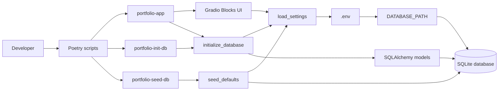

The main command is:

```bash
poetry run portfolio-app
```

`portfolio-app` initializes the database first, then launches the Gradio application. This keeps a fresh local clone easy to run without a separate manual setup step.

## Package Layout

```text
PortfolioManagement/
├── .env
├── pyproject.toml
├── README.md
├── doc/
│   └── architecture.md
├── spec/
│   └── spec_main.md
├── src/
│   └── portfolio_management/
│       ├── app.py
│       ├── config.py
│       └── db/
│           ├── base.py
│           ├── init_db.py
│           ├── models.py
│           ├── seed.py
│           ├── session.py
│           └── types.py
│       └── services/
│           ├── accounts.py
│           ├── query_filters.py
│           └── transactions.py
└── tests/
    └── test_database.py
```

## Module Responsibilities

```mermaid
flowchart TB
    App[src/portfolio_management/app.py]
    Config[src/portfolio_management/config.py]
    Init[src/portfolio_management/db/init_db.py]
    Seed[src/portfolio_management/db/seed.py]
    Session[src/portfolio_management/db/session.py]
    Models[src/portfolio_management/db/models.py]
    Types[src/portfolio_management/db/types.py]
    Base[src/portfolio_management/db/base.py]
    Accounts[src/portfolio_management/services/accounts.py]
    Filters[src/portfolio_management/services/query_filters.py]
    Transactions[src/portfolio_management/services/transactions.py]
    MarketData[src/portfolio_management/services/market_data.py]
    Analytics[src/portfolio_management/services/analytics.py]
    Rebalancing[src/portfolio_management/services/rebalancing.py]
    Benchmarks[src/portfolio_management/services/benchmarks.py]
    Tests[tests/test_database.py]

    App --> Config
    App --> Init
    App --> Accounts
    App --> Transactions
    Init --> Config
    Init --> Base
    Init --> Models
    Init --> Seed
    Init --> Session
    Seed --> Session
    Seed --> Models
    Session --> Config
    Models --> Base
    Models --> Types
    Accounts --> Session
    Accounts --> Models
    Filters --> Models
    Transactions --> Session
    Transactions --> Models
    Transactions --> Accounts
    MarketData --> Session
    MarketData --> Models
    Analytics --> Session
    Analytics --> Models
    Rebalancing --> Session
    Rebalancing --> Models
    Rebalancing --> Analytics
    Benchmarks --> Session
    Benchmarks --> Models
    Benchmarks --> Analytics
    Tests --> Base
    Tests --> Models
    Tests --> Seed
    Tests --> Transactions
```

### `app.py`

Builds the Gradio interface with the current Epic 1 tabs:

- Dashboard
- Brokers
- Accounts
- Portfolios
- Data Entry
- Performance
- Tax
- Settings

The UI is intentionally skeletal but uses real Gradio components so future epics can wire backend services directly into the tabs.

The Brokers tab lists broker records. The Accounts tab creates broker accounts without creating portfolios and lists existing accounts. The Portfolios tab creates one or more portfolios under an existing account and lists existing portfolios. The Data Entry tab uses dependent account/portfolio dropdowns, manual transaction entry, CSV upload, and a transaction table refresh. UI callbacks delegate persistence and validation to service modules.

### `config.py`

Loads configuration from `.env` using `load_dotenv`.

Current setting:

```bash
DATABASE_PATH=/Users/joaoramo/Data/trading_experiment/portfolio_management.sqlite3
```

The database directory is created automatically by the database session/init code.

### `db/models.py`

Defines the SQLAlchemy ORM schema. This is the main data foundation for later application features.

The central ownership hierarchy is:

```text
Broker -> Account -> Portfolio -> Transaction
```

`Account.is_simulated` is the firewall flag for paper trading/test accounts.

### `db/types.py`

Defines `SqliteDecimal`, a SQLAlchemy `TypeDecorator` that stores `Decimal` values as text. SQLite does not have a native exact decimal type, so this prevents unwanted float coercion for money, quantities, fees, prices, and allocation weights.

### `db/session.py`

Creates SQLAlchemy engines and session factories using the configured SQLite path.

### `db/init_db.py`

Creates tables from SQLAlchemy metadata and optionally runs default seed data.

### `db/seed.py`

Adds initial benchmarks and strategy records in an idempotent way.

### `services/transactions.py`

Owns transaction ingestion behavior:

- Parses manual form values and CSV rows.
- Normalizes CSV aliases such as `Symbol` to `Ticker` and `Shares` to `Quantity`.
- Routes manual and CSV trades to a portfolio.
- Creates broker, account, portfolio, and security records as needed for legacy/name-based ingestion.
- Validates transaction-specific rules.
- Stores `BUY`, `SELL`, `DIVIDEND`, `SPLIT`, `DEPOSIT`, and `WITHDRAWAL` transactions.
- Stores split ratios in `Transaction.quantity` with zero cash flow.

### `services/market_data.py`

Owns Epic 3 market data ingestion:

- Fetches missing daily security close prices with `yfinance`.
- Stores security closes in `PriceHistory`.
- Detects currency mismatches between account currency and security currency.
- Fetches FX rates using Yahoo Finance symbols such as `EURGBP=X`.
- Stores FX rates in `FxRateHistory`.
- Exposes a summary table used by the Market Data tab.

### `services/analytics.py`

Owns Epic 4 analytics:

- Aggregates transactions into current positions.
- Calculates average cost from transaction cost basis.
- Combines positions with latest `PriceHistory` for unrealized P&L.
- Uses FIFO lots to calculate realized P&L on sells.
- Builds a time-weighted return curve from daily valuation and external cash flows.
- Applies the Live/Sandbox account mode used by Epic 5.
- In Live Mode, analytics include real accounts only.
- In Sandbox Mode, analytics include simulated accounts only.
- Produces allocation datasets by asset class and currency for dashboard visualizations.
- Produces tax-prep reports with realized gains and dividends.
- Exports tax-prep reports as CSV files.

### `services/rebalancing.py`

Owns Epic 6 rebalancing:

- Stores target asset-class allocations per account using `AccountStrategy`.
- Treats `Strategy.name` as the target asset class for this phase.
- Compares current allocation against target allocation.
- Produces drift and suggested buy/sell value by asset class.

### `services/benchmarks.py`

Owns Epic 6 benchmark overlay:

- Lists seeded benchmarks.
- Builds a normalized portfolio TWR index.
- Fetches benchmark close history on demand.
- Normalizes benchmark prices to base 100 for comparison.

### `services/accounts.py`

Owns broker/account/portfolio listing, account creation, portfolio creation, and dropdown choice helpers. Simulated accounts are labelled with `[TEST]` in UI choices.

### `services/query_filters.py`

Defines the production query firewall. Global net worth, total performance, and dashboard summary queries must use `exclude_simulated_accounts()` by default unless they intentionally build a sandbox/test view.

## Data Model

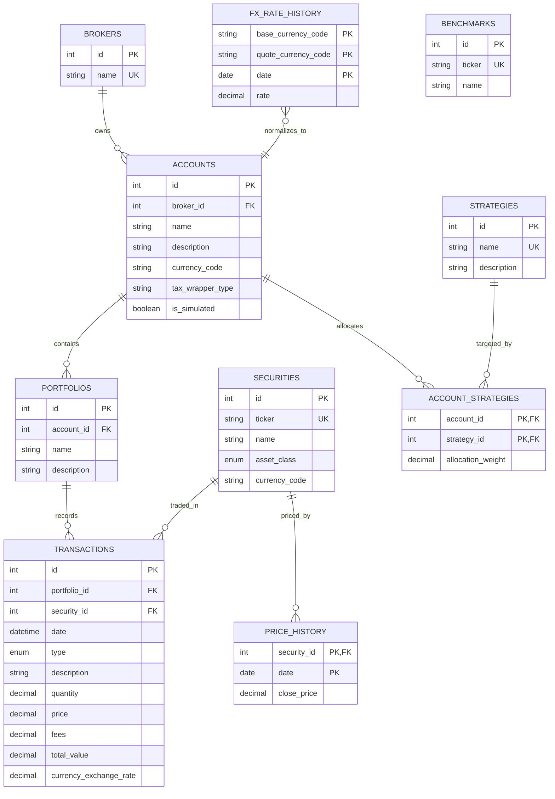

## Startup Flow

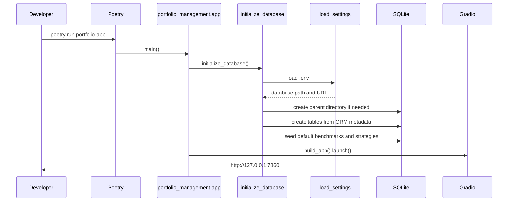

## Database Initialization

Use this command to create or update the local SQLite schema:

```bash
poetry run portfolio-init-db
```

The command is safe to run repeatedly. Table creation is handled by SQLAlchemy metadata, and default seed records are checked before insert.

To seed defaults explicitly:

```bash
poetry run portfolio-seed-db
```

## Decimal Storage Decision

Financial systems should avoid binary floating point for money and share quantities. This project uses Python `Decimal` in the ORM and stores values in SQLite as strings through `SqliteDecimal`.

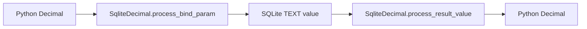

This keeps values such as `0.3333333333333333333333333333` round-tripping exactly.

## Current Command Surface

| Command | Purpose |
| --- | --- |
| `poetry install` | Install runtime and dev dependencies |
| `poetry run portfolio-init-db` | Create tables and seed default data |
| `poetry run portfolio-seed-db` | Seed default benchmarks and strategies |
| `poetry run portfolio-app` | Initialize DB and run Gradio |
| `poetry run pytest` | Run the test suite |

## Transaction Ingestion Flow

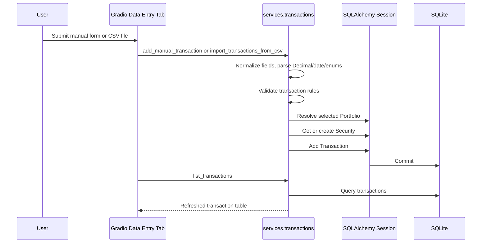

## Market Data Flow

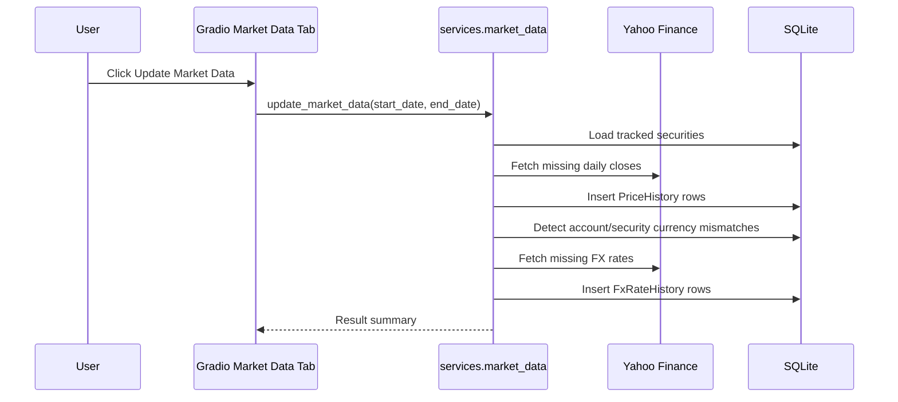

## Analytics Flow

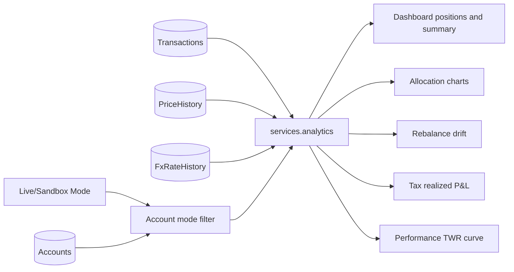

## Epic 6 Flow

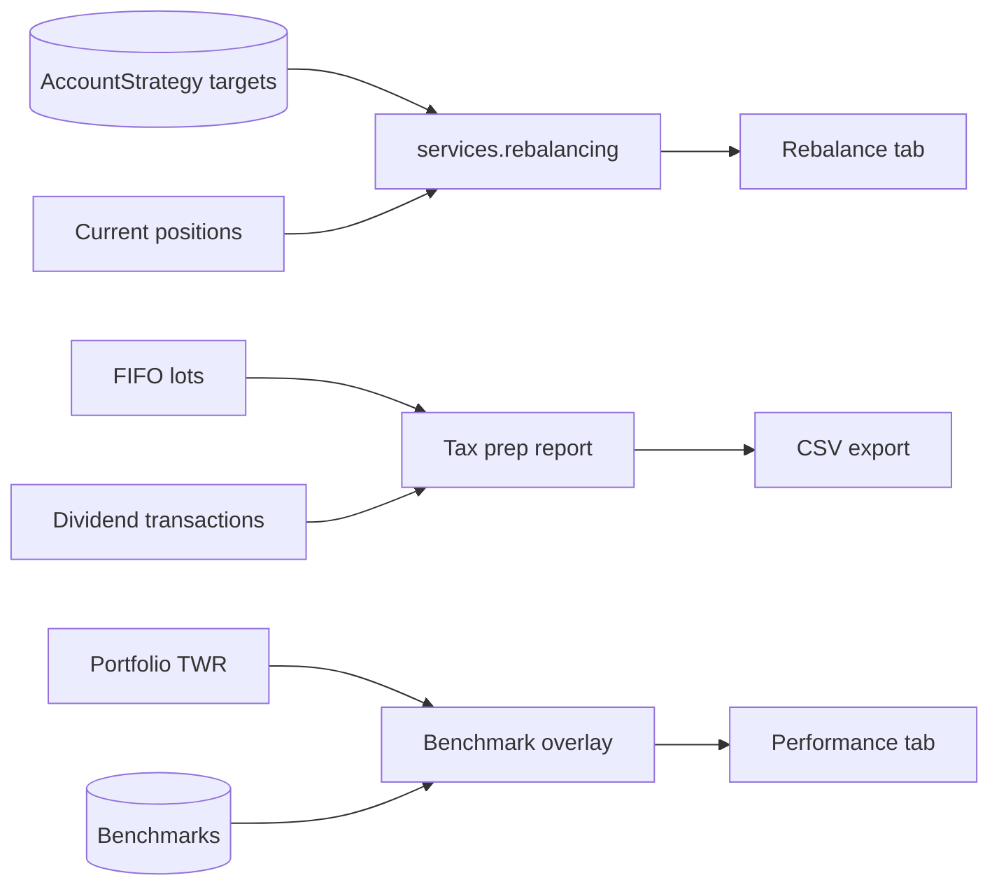

## Dashboard Mode

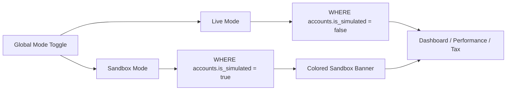

## Simulation Firewall

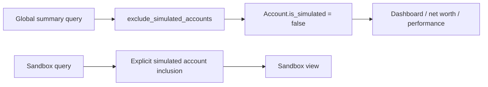

Golden rule: any query calculating global net worth, total performance, or dashboard summary must exclude simulated accounts by default. Simulated accounts should only be included when explicitly requested or in a dedicated sandbox view.

## Extension Points For Future Epics

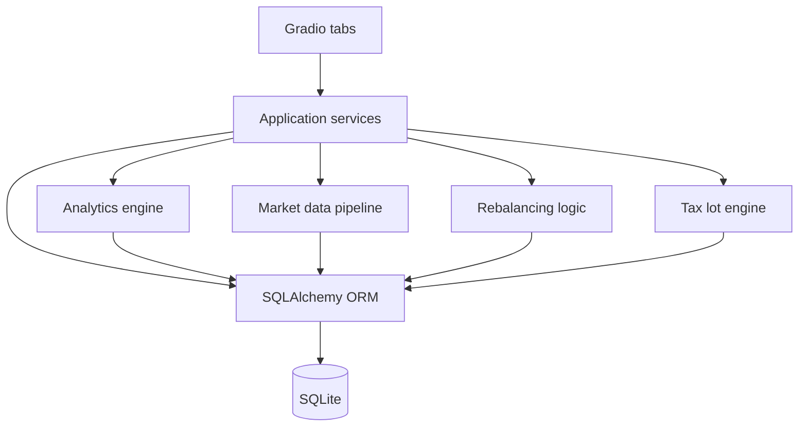

Recommended future package additions:

- `services/transactions.py` for manual and CSV transaction ingestion.
- `services/market_data.py` for price and FX loading.
- `analytics/positions.py` for current holdings and average cost.
- `analytics/tax.py` for FIFO realized gain calculations.
- `analytics/performance.py` for daily valuation and time-weighted return.
- `ui/` modules if `app.py` becomes too large as Gradio tabs gain real workflows.

## Onboarding Checklist

1. Install dependencies:

   ```bash
   poetry install
   ```

2. Confirm `.env` has the expected database path:

   ```bash
   DATABASE_PATH=/Users/joaoramo/Data/trading_experiment/portfolio_management.sqlite3
   ```

3. Initialize the database:

   ```bash
   poetry run portfolio-init-db
   ```

4. Run tests:

   ```bash
   poetry run pytest
   ```

5. Start the app:

   ```bash
   poetry run portfolio-app
   ```

6. Open the local Gradio URL:

   ```text
   http://127.0.0.1:7860
   ```

## Development Notes

- Keep database access behind SQLAlchemy sessions.
- Use `Decimal` for financial values and avoid floats in persistence or calculations.
- Keep seed scripts idempotent.
- Prefer adding focused service modules as features arrive instead of placing business logic directly in `app.py`.
- Add tests whenever a new service performs database writes, financial calculations, or import transformations.
